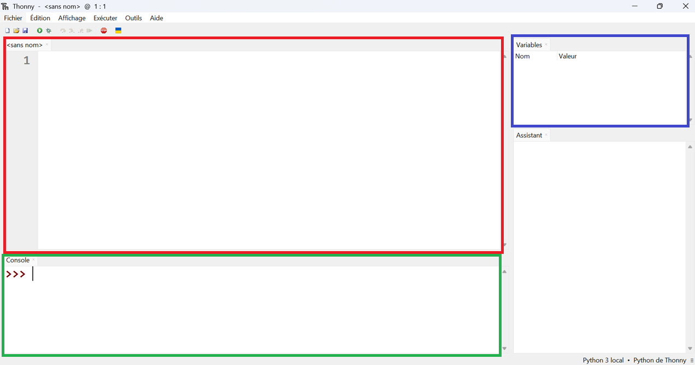

# Cours 0 : Thonny et son interface

Cette année, pour faire du Python, nous utiliserons Thonny, un environnement de développement intégré (IDE). Celui-ci permet d'écrire et exécuter du code Python, ce cours va vous résumer rapidement son interface :



On retrouve :

- En rouge : l'éditeur de code, c'est ici que vous écrirez vos programmes et fonctions. Pour exécuter le programme, il vous suffira d'appuer sur F5 ou sur le petit bouton play juste au dessus.

- En vert : l'interpréteur Python, dans cette zone, vous pourrez directement agir avec Python en lui donnant une instruction précise qu'il exécutera. C'est très pratique, notamment pour tester ses fonctions sans avoir à alourdir le programme principal.

- En bleu : le menu des variables, pour l'activer, il vous faut aller dans Affichage puis Variables. C'est un onglet intéressant car il vous permettra d'avoir une vue sur les variables définies par le programme ainsi que leur contenu.

!!! test example "À tester"
    Réussissez à faire afficher l'écran des variables puis dans la console tapez : `nsi = "Hello World !"` . Que constatez-vous?

Maintenant, testons un premier programme pour prendre la main. Pour pouvoir l'exécuter, il vous faudra enregistrer le fichier sur la machine. C'est l'occasion pour vous de créer un dossier NSI et un sous dossier pour chaque chapitre.

!!! example "À tester"
    Une fois le fichier enregistré, recopiez le programme suivant et exécutez le

    ```python
    nom = input("Quel est votre prénom ?")
    print("Bienvenue en NSI, " + nom)
    print("Bon courage")
    ```

!!! question "Question"
    D'après vous, que font `print()` et `input()` ?

Vous êtes maintenant prêts pour le vrai premier cours qui vous fera découvrir les bases du langage Python essentielles pour la suite
