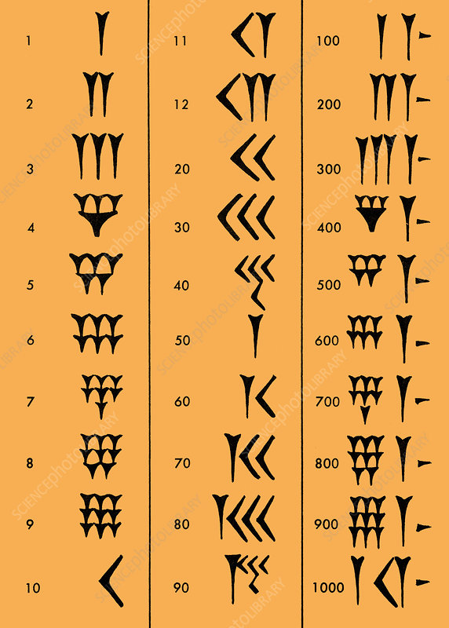

# Cours 1 : Les bases de numération

Historiquement, il a existé une multitude de manières d'écrire les nombres. Nous utilisons aujourd'hui principalement la **numération décimale**, avec les 10 chiffres de `0` à `9`.

Mais l'histoire de la numération remonte à bien plus loin : il y a plusieurs milliers d'années, différentes civilisations ont développé leurs propres systèmes pour représenter les nombres.

Voici par exemple une trace d'un ancien système de numération utilisé en Mésopotamie :

Vous remarquerez que ce système est très différent du nôtre.

## Des systèmes de numération différents

Il existe plusieurs manières de représenter les nombres.

Dans certains systèmes, la valeur d'un nombre dépend principalement des **symboles utilisés**. On parle alors de **numération additive**.

Par exemple, dans la numération romaine :

$$
VIII = 5+1+1+1 = 8
$$

Les trois `I` représentent chacun une unité, quelle que soit leur position.

NB : La notation romaine reste particulière, elle est additive dans son principe mais il y a également une règle de soustraction si une valeur plus petite se trouve avant une plus grande.

Notre système fonctionne différemment. Il est **positionnel** : la valeur d'un chiffre dépend entièrement de sa position.

Par exemple :

$$
317 = 3\times100 + 1\times10 + 7\times1
$$

La valeur ajoutée par chaque chiffre dépend donc de sa position dans le nombre.

Cette propriété permet d'écrire de très grands nombres avec seulement quelques chiffres ce qui est un avantage par rapport à d'anciens systèmes.

!!! tip "À retenir" 
    Dans une numération **additive**, les symboles ont une valeur qui ne dépend généralement pas de leur position.
    Dans une numération **positionnelle**, la valeur d'un chiffre dépend de sa position.

## La notion de base

Dans un système positionnel, le nombre de chiffres disponibles définit la **base** du système.

Notre système habituel utilise 10 chiffres :

`0 1 2 3 4 5 6 7 8 9`

Il s'agit donc de la **base 10**, ou numération décimale.

Dans une numération positionnelle, chaque position correspond à une puissance de la base.

Ainsi :

$$
352 = 3\times10^2 + 5\times10^1 + 2\times10^0
$$

On peut représenter les différentes positions ainsi :

| Position | \(10^2\) | \(10^1\) | \(10^0\) |
| -------- | -------: | -------: | -------: |
| Chiffre  |        3 |        5 |        2 |
| Valeur   |      300 |       50 |        2 |

La même logique fonctionne avec n'importe quelle base. On appelle sa la décomposition en puissance de 10 (ou d'une autre puissance)

## La base 2

En informatique, on utilise notamment la **base 2**, appelée **binaire**.

Elle ne possède que deux chiffres :

`0` et `1`

Les positions correspondent alors aux puissances de 2 :

$$
2^0,\ 2^1,\ 2^2,\ 2^3,\ldots
$$

Par exemple :

$$
1011_2
$$

correspond à :

$$
1\times2^3 + 0\times2^2 + 1\times2^1 + 1\times2^0
$$

soit :

$$
8+0+2+1=11
$$

Le nombre `1011` en base 2 représente donc le nombre `11` en base 10.

!!! tip "À retenir" 
    Dans une numération positionnelle de base \(b\), les positions correspondent aux puissances :
    $$
    b^0,\ b^1,\ b^2,\ b^3,\ldots
    $$
    La base 10 utilise les chiffres de `0` à `9`.
    La base 2 utilise uniquement `0` et `1`.

!!! warning "attention"
    Lorsque l'on écrit un entier en forme binaire, il est essentiel de préciser qu'il est écrit sous cette forme car ce n'est pas quelque chose d'habituel. Par exemple, l'entier 11 s'écrit en binaire $$1011_2$$ et on ajoute donc la base en petit en dessous à droite du nombre, parfois à côté d'un trait vertical.

## D'autres bases

Il existe de nombreuses autres bases.

Par exemple, la **base 16**, appelée **hexadécimale**, utilise 16 symboles :

`0 1 2 3 4 5 6 7 8 9 A B C D E F`

Les lettres représentent les valeurs de 10 à 15 :

* `A` représente 10 ;
* `B` représente 11 ;
* ...
* `F` représente 15.

La base 16 est particulièrement utilisée en informatique car elle permet d'écrire des nombres binaires de manière beaucoup plus compacte.
